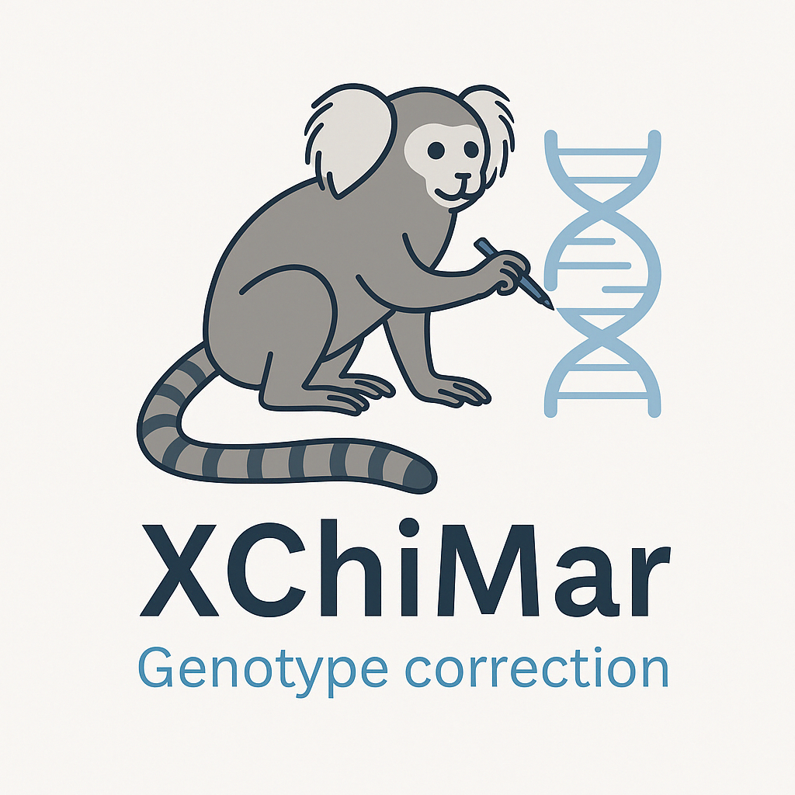

<p align="center">
  
</p>

## XChiMar: Machine Learning-Based Genotype Correction in Chimeric Marmosets

**XChiMar** is a machine learning-based genotyping correction tool specifically designed to address chimerism-induced errors in next-generation sequencing (NGS) data from _Callithrix_ marmosets. It leverages an XGBoost classifier trained on allele balance metrics to improve variant calling accuracy in chimeric, non-blood tissues such as hair follicles, tail, and ear.

## Introduction
In chimeric marmosets, especially in non-blood tissues, standard variant callers tend to misclassify variant genotypes due to DNA contamination from the co-twin’s genome. We trained a robust model using nested cross-validation on 5.4 million gold-standard SNVs and demonstrated that our correction reduces genotyping errors significantly while preserving true heterozygosity.

## Features
- **Optimized for chimeric organisms** : Corrects systematic genotyping biases arising from twin-derived DNA contamination.
- **Machine learning powered** : Trained with high-confidence genotype labels using XGBoost.
- **Input-agnostic** : Works with standard VCF files derived from tools like ‘GATK’ or `bcftools mpileup`.
- **Interpretable predictions ** : Provides insights into false positives and false negatives caused by heterozygous overcalls.
- Validated across 56 chimeric common marmosets and applied to public datasets across _Callithrix jacchus_, _C. geoffroyi_, and _C. kuhlii_. 


## System Requirements

This pipeline requires a Unix-like environment with the following dependencies:

#### Shell tools
- `bash`
- `awk`
- `bcftools` (>= 1.9)
- `htslib` (>= 1.9)

#### Programming environments
- `R` (>= 4.3.3)
- `Python3`

#### R packages
Install the required packages in R:
```r
install.packages(c("data.table", "xgboost", "caret", "pROC", "PRROC"))
```
  
## Usage

XChiMar can be executed with a single shell command using the provided `run_XChiMar.sh` script.  
This script performs genotype correction using a pre-trained XGBoost model (`xgboost_final_model.rds`).

```bash
bash run_XChiMar.sh config.yml

```

  


```markdown
## Example
Example data and scripts are available at: [https://github.com/GRFcenter/XChiMar/](https://github.com/GRFcenter/XChiMar/)

Using the provided input file (`example_data/input_data/1612151M.vcf.gz`),  
you can evaluate genotype prediction performance with the XChiMar model  
and generate an updated VCF file containing the corrected genotypes.

```
### Example `config.yml`

Below is an example configuration file for running the XChiMar pipeline. Modify the paths according to your environment:

```yaml
# config.yml

# Input VCF file parsed for XChiMar (generated using Step1 script or provided in example_data)
input_dir: "./example_data/input_data"

# Output directory for corrected VCF and performance metrics
output_dir: "./example_data/output_data"

# Path to pre-trained XChiMar model (XGBoost .rds file)
model_path: "./model/xgboost_final_model.rds"


- The actual XChiMar can be easily run as follows: bash run_XChiMar.sh config.yml
```
  
## LICENSE
This project is licensed under the [MIT License](LICENSE) with a patent notice. See the LICENSE file for details.
For commercial use or questions regarding the pending patent, please contact [grf@pgi.re.kr](mailto:grf@pgi.re.kr).

    
## Contact
pgi@grf.re.kr

## Version
XChiMar ver. 1

